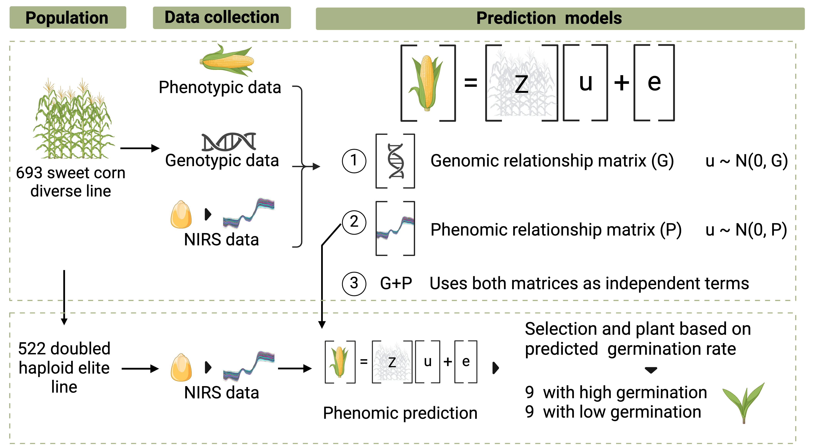

# Graciano_skNIR_Phenomic_Seleciton
This repository contains the scripts and data of the paper "Integrating Phenomic Selection Using Single-Kernel Near-Infrared Spectroscopy and Genomic Selection for Corn Breeding Improvement".

## Content
**1.Datasets:** Contains the phenotypic, phenomic, and genotypic datasets for running the analyses.  

NIRS_S19: skNIR data from the diversity panel obtained from kernels harvested in 2019.  
NIRS_S20: skNIR data from the diversity panel obtained from kernels harvested in 2020.  
NIRS_DH: skNIR data obtained from doubled haploids.  
SNP_data: Markers coded 0,1,2.  
BLUE_BLUP_C19:BLUEs and BLUPs for the traits assessed in Citra in 2019.  
BLUE_BLUP_C21: BLUEs and BLUPs for the traits assessed in Citra in 2021.  
BLUE_BLUP_C22: BLUEs and BLUPs for the traits assessed in Citra in 2022.  
DH_24: Germination rate from double haploids selected with phenomic selection and assessed in Citra in 2024.

**2.Analysis:**  
Prediction_models_CV1: Preprocessing phenomic data and predictions models with CV1 cross-validation.  
Predicting_DHs: Preprocessing phenomic data and phenomic prediction for doubled haploid validation.

## Material and Methods overview

